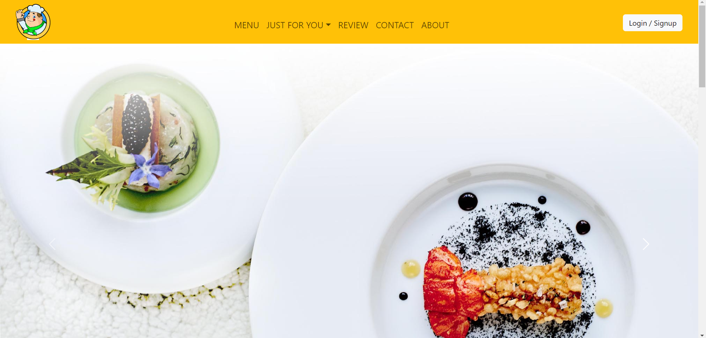
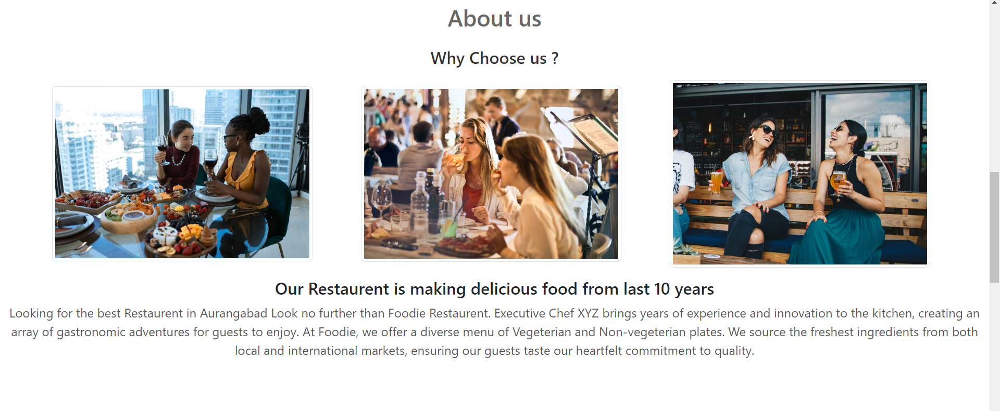
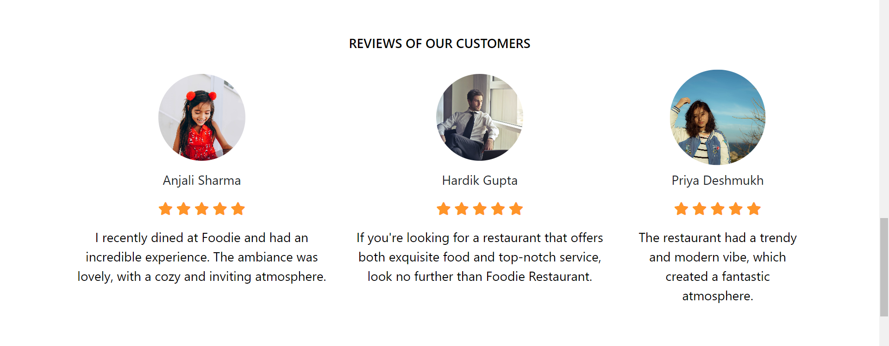
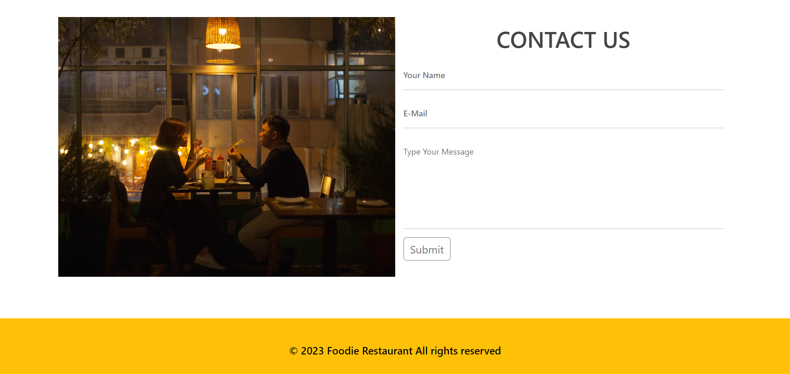
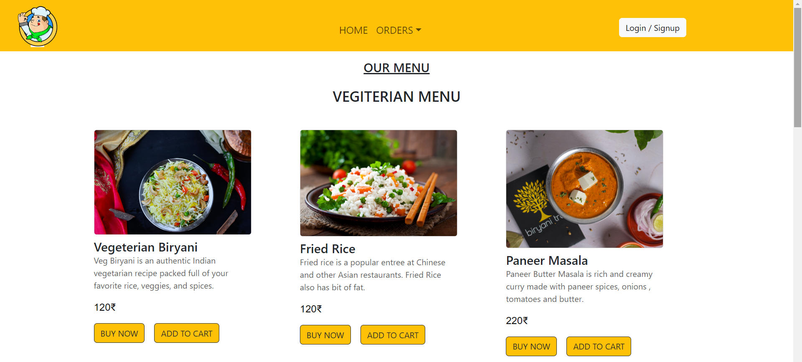
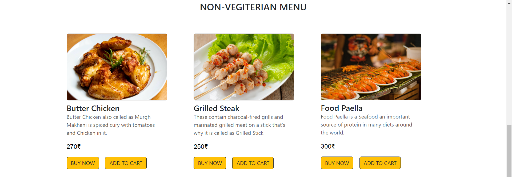

# Foodie-Restaurant :)

<h1 align="center">Hello Everyone I am Ayush Shyam Lingayat</h1>
<h3 align="center">I Am a Front End Developer from India</h3>
<h3 align="center">I have designed this foodie restaurant website using HTML, CSS, JavaScript, and Bootstrap</h3>
<h3 align="center">Hope you like this website :)</h3>

## Website Preview

## Home Page

## About us Page

## Reviews Page

## Contact us Page

## Vegiterian Menu

## Non-Vegiterian Menu

  

- 💬 Ask me about **Designing and Development**

- 📫 How to reach me **lingayatayush3@gmail.com**

- ⚡ Fun fact **Coding is never ending process**

<h3 align="left">Connect with me:</h3>

